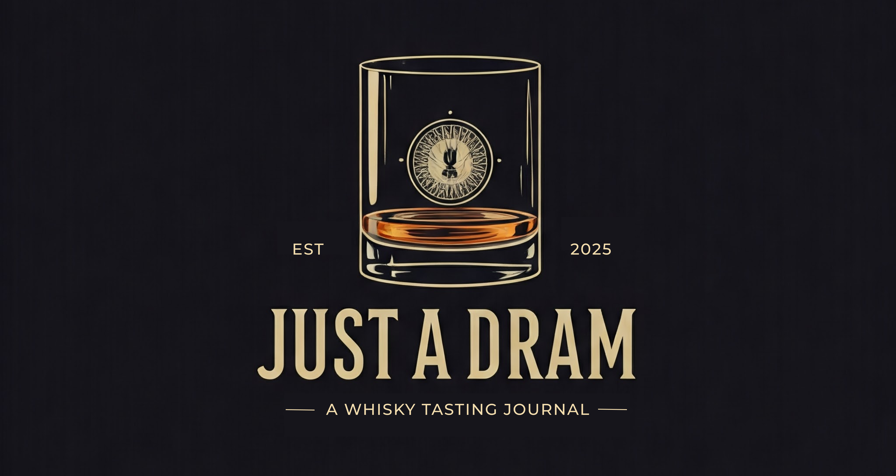
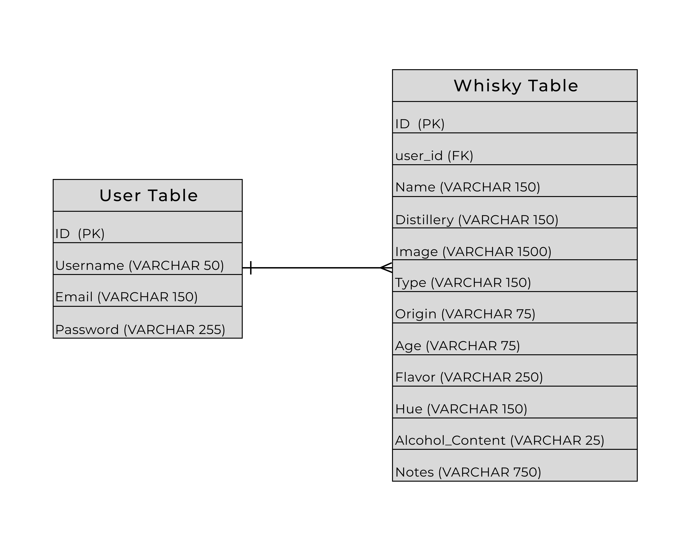

# Just a Dram, Too

## 

## About

Just a Dram, Too is an app to record the various whiskies one has tasted. The user can also add new entries as well as update or delete said entries.

This app is a remake of the original, [Just a Dram](https://github.com/chamer079/just-a-dram), built using the MEN stack with full CRUD capabilities. Just a Dram, Too is built using Flask, Postgres SQL, and React; while maintaining full CRUD capabilities.

## Deployed Links

Back-End Link - [Heroku Link](https://git.heroku.com/just-a-dram-too-backend.git)

Front-End Link - TBD

## Konbon Board

[How I planned out this project.](https://trello.com/invite/b/679439dd215a8d1672f52ab8/ATTIc1b66a88a94d38d877a300da4b071dba20A07CA9/just-a-dream-flask-react)

## Wireframe

[Here's the initial design for the app.](https://www.figma.com/design/xdU0zIj7KQVVHWTCEphxym/Just-A-Dram---Flask-Version?node-id=0-1&t=iGylWXL4A3jc5Z1Z-1)

## ERD

## User Stories

- As a user, I want to login to my whisky journal.
- As a user, I want to be able to see all of the whisky entries that I've made with a brief description of the whiskies.
- As a user, I want to be able to see the detailed information regarding one particular whisky.
- As a user, I want to be able to create an entry for the following topics:
  - Name of the whisky.
  - The distillery that made it.
  - Where it was made.
  - The type of whisky.
  - Adding an image of the whisky.
  - The age statement of the whisky.
  - The color is the whisky.
  - The proof/ABV of the whisky.
  - The flavor profile of the whisky.
  - My thoughts about said whisky.
- As a user, I want to be able to edit a specific entry if I made a mistake in the entry.
- As a user, I want to delete a whisky that I no longer want to have in my journal.

## Attributions

Thank you to the following for sharing such high quality images on [Unsplash](https://unsplash.com/) that were used in this project:

- [Katherine Conrad](https://unsplash.com/@katherineconrad?utm_content=creditCopyText&utm_medium=referral&utm_source=unsplash) for the [rickhouse](https://unsplash.com/photos/brown-wooden-barrels-on-rack-QL3SaEwio_k) photo.
- [Kevin Kristhian](https://unsplash.com/@kevinthepeople?utm_content=creditCopyText&utm_medium=referral&utm_source=unsplash) for the [pot still](https://unsplash.com/photos/brass-colored-container-29zMpabSkXo) photo.
- [Dylan de Jonge](https://unsplash.com/@dylandejonge?utm_content=creditCopyText&utm_medium=referral&utm_source=unsplash) for the [whisky being poured](https://unsplash.com/photos/photo-of-person-holding-glass-bottle-pe9T4ROjpzQ) photo.
- [Daniel Norris](https://unsplash.com/photos/a-shelf-filled-with-lots-of-wooden-barrels-l1kZD3_dySY?utm_content=creditShareLink&utm_medium=referral&utm_source=unsplash) for the [second rickhouse](https://unsplash.com/photos/a-shelf-filled-with-lots-of-wooden-barrels-l1kZD3_dySY) photo used in responsive design.
- [Nathan Dumlao](https://unsplash.com/@nate_dumlao?utm_content=creditCopyText&utm_medium=referral&utm_source=unsplash) for the [WhistlePig](https://unsplash.com/photos/captain-morgan-original-spiced-gold-bottle-97G8s6Bl_RQ?utm_content=creditCopyText&utm_medium=referral&utm_source=unsplash) photo.
- [Allan Francis](https://unsplash.com/@allanbenjaminfrancis?utm_content=creditCopyText&utm_medium=referral&utm_source=unsplash) for the [Woodford Reserve](https://unsplash.com/photos/a-bottle-of-woodford-reserve-sitting-on-a-table-jOEzl0bcXyE?utm_content=creditCopyText&utm_medium=referral&utm_source=unsplash) photo.
- [Jack Dylag](https://unsplash.com/@dylu?utm_content=creditCopyText&utm_medium=referral&utm_source=unsplash) for the [Talisker](https://unsplash.com/photos/talisker-bottle-beside-drinking-glass-JwWKV2gCPkE?utm_content=creditCopyText&utm_medium=referral&utm_source=unsplash) photo.

Thank you to ChatGPT for creating the neat pour of whikey logo.

## Technologies Used

- Flask
- Postgres SQL
- React
- CSS
- Tailwind CSS

## PMVPS

- Incorporate a CSS library for:
  - Flavor Wheel
  - Color Scale
  - Rating System
- Inpcorporate sorting functionality to sort...

  - Highest to Lowest Ratings
  - Lowest to Highest Ratings
  - Newest - Oldest Whiskies
  - Oldest to Newest Whiskies
  - Type of Whisky

- Incorporate Google Sign-in functionality.
- Incorporate a sharable function to see what whiskies your friends tasted and liked/dislike.
- Incorporate a 3rd party API to purchase the whisky. Which establishments sell the spirit and price point.
- Convert this app to a mobile app using React Native.
